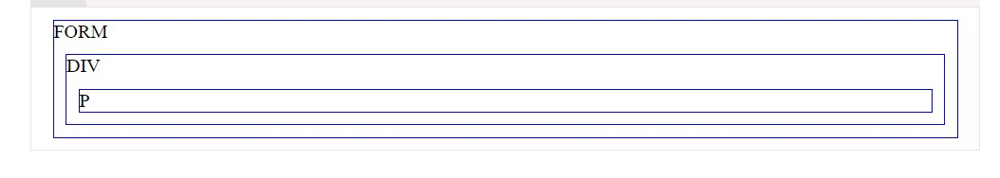
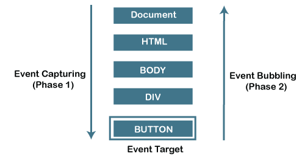

# JavaScript Interview Questions & Answers

   > Click :star: Please follow me on GitHub and LinkedIn [@RameshKumar](https://www.linkedin.com/in/ramesh-kumar-choudhary/) for more updates.


   ## JavaScript Coding Challenges and Interview Question list available here :-

   >1. Click here for [Javascript Basics Coding](https://github.com/rseetech/javascript-basics) more information.
   >  
   >2. Click here for [Javascript Coding Challenges](https://github.com/rseetech/javascript-coding-challenges) more information.
   >
   >3. Click here for [Javascript quick coding interview questions](https://github.com/rseetech/javascript-quick-coding-interview-questions) more information. 
   >
   >3. Click here for [Javascript interview asking output questions](https://github.com/rseetech/javascript-interview-asking-output-questions) more information. 


   ## React nterview Questions & Coding Project list available here :-

   >1. Click here for [React Interview Questions & Answers](https://github.com/rseetech/React-interview-questions) more information.
   >
   >2. Click here for [React Routing Axios Search Counter App Using MUI](https://github.com/rseetech/react-routing-axios-search-counter-app-using-mui) more information.
   >
   >3. Click here for [React Routing Pass data Child to Parent](https://github.com/rseetech/react-router-axios-pass-data-child-to-parent) more information.
   >
   >4. Click here for [React Create Tic Tac Toe Game](https://github.com/rseetech/react-create-tic-tac-toe-game) more information.


### Table of Contents

| No. | Questions                                                                              |
| --- | -------------------------------------------------------------------------------------------------------------------------------------------------------------------------------------------------------------- |
| 1  | [What is a promise ](#what-is-a-promise)      |
| 2  | [Why do you need a promise ](#why-do-you-need-a-promise)     |
| 3  | [What are the three states of promise ](#what-are-the-three-states-of-promise)       |
| 4  | [What is promise all ](#what-is-promise-all)     |
| 5  | [Event bubbling ](#event-bubbling)     |
| 6  | [How to Stop Event bubbling ](#how-to-stop-event-bubbling)     |
| 7  | [Event Capturing ](#event-capturing)     |


1. ### What is a promise
   A promise is an object that may produce a single value some time in the future with either a resolved value or a reason that it’s not resolved(for example, network error). 
   
   It will be in one of the 3 possible states: **fulfilled, rejected, or pending.**

   The syntax of Promise creation looks like below,
   
      ```
         const promise = new Promise(function (resolve, reject) {
         // promise description
         });
         The usage of a promise would be as below,
         const promise = new Promise(
         (resolve) => {
            setTimeout(() => {
               resolve("I'm a Promise!");
            }, 5000);
         },
         (reject) => {}
         );

         promise.then((value) => console.log(value));
         
      ```

   **[⬆ Back to Top](#table-of-contents)**
   
2. ### Why do you need a promise

   Promises are used to handle asynchronous operations. They provide an alternative approach for callbacks by reducing the callback hell and writing the cleaner code.

   **[⬆ Back to Top](#table-of-contents)**
   
3. ### What are the three states of promise

   Promises have three states:

   i.	**Pending:** This is an initial state of the Promise before an operation begins

   ii. **Fulfilled:** This state indicates that the specified operation was completed.
   
   iii. **Rejected:** This state indicates that the operation did not complete. In this case an error value will be thrown.

   **[⬆ Back to Top](#table-of-contents)**

4. ### What is promise all

   Promise.all is a promise that takes an array of promises as an input (an iterable), and it gets resolved when all the promises get resolved or any one of them gets rejected. For example, the syntax of promise.all method is below,
   

   Promise.all([Promise1, Promise2, Promise3]) 
      .then(result) => {   console.log(result) }
      .catch(error => console.log(`Error in promises ${error}`))


   **[⬆ Back to Top](#table-of-contents)**

5. ### Event bubbling

   The bubbling principle is simple.

   When an event happens on an element, it first runs the handlers on it, then on its parent, then all the way up on other ancestors.

   Let’s say we have 3 nested elements FORM > DIV > P with a handler on each of them:

   ```
   <style>
   body * {
      margin: 10px;
      border: 1px solid blue;
   }
   </style>

   <form onclick="alert('form')">FORM  // first 
      <div onclick="alert('div')">DIV  // Second
         <p onclick="alert('p')">P</p> // Third
      </div>
   </form>

   ```

   

   


   The Event bubbling in JavaScript is a type of event propagation. The event triggers the innermost target element and consecutively triggers the parent element of the target element in the same hierarchy until it triggers the outermost element.

   It is a procedure where it starts from the element that triggered the event and then bubbles up to the ancestor elements in the hierarchy.   

   **[⬆ Back to Top](#table-of-contents)**

6. ### How to Stop Event Bubbling
   
   Event Bubbling is a default behavior for events. But in some cases, you might want to prevent this.

   Let's say, for example, from our HTML code, that you want the div to open a modal when it is clicked. For the button, on the other hand, you want it to make an API request when it is clicked.

   In this case, you may not want the modal to open when you click the button. You might want the modal to only open when you actually click it (and not when you click any of its children). This is where preventing event propagation comes in.

   To prevent event bubbling, you use the `stopPropagation` method of the event object.

   ```
      button.addEventListener("click", (event) => {
         // do anything with the event object
      }

      body.addEventListener('click', () => {
         console.log("body was clicked")
      })

      div.addEventListener('click', () => {
         console.log("div was clicked")
      })

      span.addEventListener('click', () => {
         console.log("span was clicked")
      })

      button.addEventListener('click', (event) => {
         event.stopPropagation()
         console.log("button was clicked")
      })

   ```

   **[⬆ Back to Top](#table-of-contents)**

7. ### Event Capturing

    **Event Capturing is opposite to event bubbling,** where in event capturing, an event moves from the outermost element to the target. Otherwise, in case of event bubbling, the event movement begins from the target to the outermost element in the file. Event Capturing is performed before event bubbling but capturing is used very rarely because event bubbling is sufficient to handle the event flow.

   ```
      <form onclick="alert('form')">FORM  // Third
         <div onclick="alert('div')">DIV  // Second
            <p onclick="alert('p')">P</p> // first
         </div>
      </form>

   ```

   There’s another phase of event processing called `“capturing”`. It is rarely used in real code, but sometimes can be useful.

   The standard DOM Events describes 3 phases of event propagation:

   **Capturing phase** – the event goes down to the element.

   **Target phase** – the event reached the target element.

   **Bubbling phase** – the event bubbles up from the element.

   Here’s the picture, taken from the specification, of the capturing (1), target (2) and bubbling (3) phases for a click event on a <td> inside a table: 

   **[⬆ Back to Top](#table-of-contents)**

8. ### Closure in JavaScript

   A closure is a feature of JavaScript that allows inner functions to access the outer scope of a function. Closure helps in binding a function to its outer boundary and is created automatically whenever a function is created. A block is also treated as a scope since ES6. Since JavaScript is event-driven so closures are useful as it helps to maintain the state between events.

   ```
      function init() {
         var name = "Mozilla"; // name is a local variable created by init
         function displayName() {
            // displayName() is the inner function, that forms the closure
            console.log(name); // use variable declared in the parent function
         }
         displayName();
      }
      init();
      
   ```
   **[⬆ Back to Top](#table-of-contents)**

9. ### Async/await

   There’s a special syntax to work with promises in a more comfortable fashion, called “async/await”. It’s surprisingly easy to understand and use.

   await
   The await operator is used to wait for a Promise and get its fulfillment value. It can only be used inside an async function or at the top level of a module.

   function resolveAfter2Seconds(x) {
   return new Promise((resolve) => {
      setTimeout(() => {
         resolve(x);
      }, 2000);
   });
   }

   async function f1() {
   const x = await resolveAfter2Seconds(10);
   console.log(x); // 10
   }

   f1();

   **[⬆ Back to Top](#table-of-contents)**

10. ### Implementation of Queue data structure in Javascript

   In This article, we would be implementing Queue data structure in javascript. A Queue works on the FIFO(First in First Out) principle. Hence, it performs two basic operations which are the addition of elements at the end of the queue and the removal of elements from the front of the queue. Like Stack, Queue is also a linear data structure. 

   Note: Assuming a queue can grow dynamically we are not considering the overflow condition Now let’s see an example of a queue class using an array:- 

   To implement a queue data structure we need the following methods:

   enqueue : To add elements at end of the queue.
   dequeue: To remove an element from the front of the queue.
   peek: To get the front element without removing it.
   isEmpty: To check whether an element is present in the queue or not.
   printQueue: To print the elements present in queue.

   **[⬆ Back to Top](#table-of-contents)**

11. ### Function Overloading in JavaScript


   **[⬆ Back to Top](#table-of-contents)**


